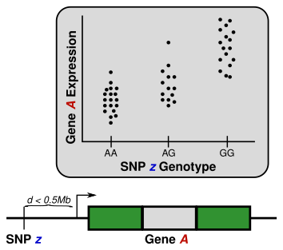

# Table of Contents

-   [eQTL background](#org44890ca)
    -   [Why eQTL analysis](#org485338b)
-   [Prepare data](#orgd7112eb)
    -   [BrainSEQ data](#orgd092cc3)
    -   [Study design](#org8ea86a4)
    -   [Phenotype data](#orgc2e1f07)
    -   [Normalized counts](#org0e42981)
        -   [Export gene annotation](#org12cc914)
    -   [Genotypes](#orga784028)
        -   [Population structure](#org67614d1)
    -   [R session information](#orgbb1bd13)

# eQTL background

Quantitative trait loci (QTL) analysis relays on genetic variant
data (i.e., SNP) and another kind of molecular trait (i.e.,
expression, protein, or DNA methylation). The idea is to test
if a specific molecular trait changes based on allele and
allele dosage.

In general, this pipeline can be used for any kind of quantitative
data with some adaptation. However, I will be focusing on
expression QTL (eQTL) for the remainder of this tutorial.

## Why eQTL analysis

eQTL are genetic variants that explain variation in expression levels.

-   Translate GWAS to biology
-   Useful for gene prioritization
-   Detection of novel gene-trait associations
-   Inferring direction of association

Therefore, to test for these associations, we need two main information
from the same samples: 1) expression and 2) genotypes.

# Prepare data

For this analysis, we will be using the BrainSEQ data
([PMID: 26687217](https://www.ncbi.nlm.nih.gov/pubmed/26687217)), which saves processed data in R objects.
One important note is that publiclly available human
genotype data is always controlled access due to privacy
issues. This takes time to get access too, so please
address this issue first.

## BrainSEQ data

Processed data are RangedSummarizedExperiment R Objects
(hg38; GENCODE v25).

<table border="2" cellspacing="0" cellpadding="6" rules="groups" frame="hsides">

<colgroup>
<col  class="org-left" />

<col  class="org-left" />

<col  class="org-left" />

<col  class="org-left" />
</colgroup>
<thead>
<tr>
<th scope="col" class="org-left">Brain region</th>
<th scope="col" class="org-left">RNA type</th>
<th scope="col" class="org-left">Data</th>
<th scope="col" class="org-left">Reference</th>
</tr>
</thead>

<tbody>
<tr>
<td class="org-left">DLPFC</td>
<td class="org-left">Poly-A</td>
<td class="org-left"><a href="https://s3.us-east-2.amazonaws.com/jaffe-nat-neuro-2018/rse_gene_BrainSeq_Phase1_hg19_TopHat2_EnsemblV75.rda">Gene counts</a></td>
<td class="org-left"><a href="https://pubmed.ncbi.nlm.nih.gov/30050107/">PMID: 30050107</a></td>
</tr>
</tbody>

<tbody>
<tr>
<td class="org-left">DLPFC/Hippocampus</td>
<td class="org-left">total RNA</td>
<td class="org-left"><a href="https://s3.us-east-2.amazonaws.com/libd-brainseq2/rse_gene_unfiltered.Rdata">Gene counts</a></td>
<td class="org-left"><a href="https://pubmed.ncbi.nlm.nih.gov/31174959/">PMID: 31174959</a></td>
</tr>
</tbody>

<tbody>
<tr>
<td class="org-left">Caudate nucleus</td>
<td class="org-left">total RNA</td>
<td class="org-left"><a href="https://caudate-eqtl.s3.us-west-2.amazonaws.com/caudate_brainseq_phase3_hg38_rseGene_merged_n464.rda">Gene counts</a></td>
<td class="org-left"><a href="https://pubmed.ncbi.nlm.nih.gov/36319771/">PMID: 36319771</a></td>
</tr>
</tbody>
</table>

These object have counts, phenotype information, and
sequencing information that can be used for study
design.

Genotype data is controlled access.

## Study design

Before starting eQTL, it is important to have a goal in
mind. The most common study design is cis-eQTL analysis.
This is assessing variants near (within 1M bp) the transcriptional
start site (TSS). In addition to this, we could also test
for interaction models (genetic variant X phenotype) or
trans-eQTL models. For this tutorial, we will do the more
common cis-eQTL approach. As such, we will use as many
samples as possible to increase our power of detection.

Note: The BrainSEQ data set has neurotypical controls and
individuals with neuropsychiatric disorders (i.e.,
schizophrenia and bipolar disorder). However, diagnosis
status or antipsychotic status does not effect the
eQTL analysis compared with neurotypical controls
([PMID: 36319771](https://pubmed.ncbi.nlm.nih.gov/36319771/)).

## Phenotype data

Now lets extract phenotype data for the caudate
nucleus.

Let's check to make sure we're in the right place.

    pwd

    /dcs04/lieber/statsgen/jbenjami/tutorials/eqtl_analysis_tutorial

    getwd()

    [1] "/dcs04/lieber/statsgen/jbenjami/tutorials/eqtl_analysis_tutorial"

Now, we'll download the gene-level data from the eQTL data
browser website.

    caud8_file <- url(paste0("https://caudate-eqtl.s3.us-west-2.amazonaws.com/",
    			 "caudate_brainseq_phase3_hg38_rseGene_merged_n464.rda"))
    load(caud8_file)
    rse_gene

    class: RangedSummarizedExperiment 
    dim: 58037 464 
    metadata(0):
    assays(1): counts
    rownames(58037): ENSG00000223972.5 ENSG00000227232.5 ...
      ENSG00000210195.2 ENSG00000210196.2
    rowData names(10): Length gencodeID ... NumTx gencodeTx
    colnames(464): R12864 R12865 ... R13503 R13504
    colData names(71): BrNum RNum ... RNum.1 FlowCell

With the data downloaded, we can extract the phenotype information.
First, I'll load in a helpful function from [jaffelab](https://github.com/LieberInstitute/jaffelab).

    					# Function from jaffelab github
    merge_rse_metrics <- function(rse) {
        stopifnot(is(rse, 'RangedSummarizedExperiment'))
    
        rse$overallMapRate = mapply(function(r, n) {
    	sum(r*n)/sum(n)
        }, rse$overallMapRate, rse$numReads)
        rse$mitoRate = mapply(function(r, n) {
    	sum(r*n)/sum(n)
        }, rse$mitoRate, rse$numMapped)
        rse$rRNA_rate = mapply(function(r, n) {
    	sum(r*n)/sum(n)
        }, rse$rRNA_rate, rse$numMapped)
        rse$totalAssignedGene = mapply(function(r, n) {
    	sum(r*n)/sum(n)
        }, rse$totalAssignedGene, rse$numMapped)
    
        rse$numMapped = sapply(rse$numMapped, sum)
        rse$numReads = sapply(rse$numReads, sum)
        rse$numUnmapped = sapply(rse$numUnmapped, sum)
        rse$mitoMapped = sapply(rse$mitoMapped, sum)
        rse$totalMapped = sapply(rse$totalMapped, sum)
        return(rse)
    } 

Using SummarizedExperiment, I can select just the variables
we want to keep.

    suppressMessages(library(SummarizedExperiment))
    fields   <- c('BrNum', 'RNum', 'Region', 'RIN', 'Age', 'Sex', 'Race', 
    	      'Dx', 'mitoRate', 'rRNA_rate', 'overallMapRate')
    rse_gene <- merge_rse_metrics(rse_gene)
    colData(rse_gene)$RIN <- sapply(colData(rse_gene)$RIN,"[",1)
    pheno    <- colData(rse_gene)[,fields]
    dim(pheno)

    [1] 464  11

Now, let's take a look at it.

    head(pheno, 2)

    DataFrame with 2 rows and 11 columns
                 BrNum        RNum      Region       RIN       Age         Sex
           <character> <character> <character> <numeric> <numeric> <character>
    R12864      Br1303      R12864     Caudate       9.6     42.98           F
    R12865      Br1320      R12865     Caudate       9.5     53.12           M
                  Race          Dx  mitoRate   rRNA_rate overallMapRate
           <character> <character> <numeric>   <numeric>      <numeric>
    R12864          AA      Schizo 0.0326539 8.67516e-05       0.909350
    R12865          AA      Schizo 0.0197874 6.97668e-05       0.873484

    table(pheno$Dx, pheno$Race)

    
             AA CAUC
    Bipolar   4   40
    Control 134  132
    Schizo   83   71

As we want to use as many samples as possible, we will only do some
basic filtering for our study design:

1.  Including only individual age > 13, and
2.  Limit to self-identified Black and White Americans

    pheno <- dplyr::filter(as.data.frame(pheno), Age > 13, Race %in% c("AA", "CAUC"))
    head(pheno, 2)

            BrNum   RNum  Region RIN   Age Sex Race     Dx   mitoRate    rRNA_rate
    R12864 Br1303 R12864 Caudate 9.6 42.98   F   AA Schizo 0.03265387 8.675159e-05
    R12865 Br1320 R12865 Caudate 9.5 53.12   M   AA Schizo 0.01978740 6.976684e-05
           overallMapRate
    R12864      0.9093498
    R12865      0.8734840

    dim(pheno)

    [1] 444  11

Now, we'll save this as a text file to work with python.

    as.data.frame(pheno) |>
      write.csv(file = 'data/caudate_phenotypes.csv')

## Normalized counts

We next need normalized counts data. The authors of
tensorQTL and fastQTL transform their counts data using
`edgeR` TMM method.

    x <- edgeR::calcNormFactors(x, method="TMM")

They used a helper set of functions to convert this R
function into python. However, since we are already
importing data in R, we can skip the steps of converting
counts and a set of normalized expression and applying
the helper function to transform it to normalized expression
with python.

    keepIndex <- which(rse_gene$Age > 13 & rse_gene$Race %in% c("AA", "CAUC"))
    rse_gene  <- rse_gene[, keepIndex]
    					# Clean up sample names if needed
    rownames(colData(rse_gene)) <- sapply(strsplit(rownames(colData(rse_gene)), "_"), "[", 1)
    					# Generate DGE list
    x      <- edgeR::DGEList(counts=assays(rse_gene)$counts[, pheno$RNum], 
    			 genes=rowData(rse_gene), samples=pheno)
    					# Filter by expression
    design <- model.matrix(~Race, data=x$samples)
    keep.x <- edgeR::filterByExpr(x, design=design)
    print(paste('There are:', sum(keep.x), 'features left!', sep=' '))
    x      <- x[keep.x, , keep.lib.sizes=FALSE]
    					# Normalize library size
    x      <- edgeR::calcNormFactors(x, method="TMM")

    [1] "There are: 22465 features left!"

Now, we can save normalized counts data.

    cpm <- edgeR::cpm(x)
    cpm[1:5, 1:5]

                          R12864    R12865    R12866    R12867    R12868
    ENSG00000227232.5  2.9236868 2.8017454 2.9691493 2.9180193 4.4492773
    ENSG00000279457.3  3.8088397 3.6661137 3.9180527 5.0163702 3.1866445
    ENSG00000228463.9  2.2531165 4.5304820 2.9997591 4.4262090 2.5252655
    ENSG00000236679.2  0.9119757 1.0432031 0.9489034 1.3770428 0.6613791
    ENSG00000237094.11 0.2145825 0.3874754 0.4897566 0.4590143 1.1423820

    write.table(as.data.frame(cpm),
    	    file="data/caudate.normalized_expression.tsv",
    	    sep="\t", quote=FALSE)

### Export gene annotation

    genes_to_keep <- rownames(x$genes)
    length(genes_to_keep)

    [1] 22465

    head(rowRanges(rse_gene), 2)

    GRanges object with 2 ranges and 10 metadata columns:
                        seqnames      ranges strand |    Length         gencodeID       ensemblID              gene_type
                           <Rle>   <IRanges>  <Rle> | <integer>       <character>     <character>            <character>
      ENSG00000223972.5     chr1 11869-14409      + |      1735 ENSG00000223972.5 ENSG00000223972 transcribed_unproces..
      ENSG00000227232.5     chr1 14404-29570      - |      1351 ENSG00000227232.5 ENSG00000227232 unprocessed_pseudogene
                             Symbol  EntrezID       Class  meanExprs     NumTx                           gencodeTx
                        <character> <integer> <character>  <numeric> <integer>                     <CharacterList>
      ENSG00000223972.5     DDX11L1     84771       InGen 0.00186396         2 ENST00000456328.2,ENST00000450305.2
      ENSG00000227232.5      WASH7P      <NA>       InGen 1.22336500         1                   ENST00000488147.1
      -------
      seqinfo: 25 sequences from an unspecified genome; no seqlengths

    annot <- rowRanges(rse_gene) |> as.data.frame() |>
      tibble::rownames_to_column("gene_id") |>
      dplyr::filter(gene_id %in% genes_to_keep) |>
      dplyr::select(seqnames, start, end, gene_id, strand) |>
      dplyr::mutate(index=gene_id) |>
      tibble::column_to_rownames("index")
    head(annot, 2)

                      seqnames  start    end           gene_id strand
    ENSG00000227232.5     chr1  14404  29570 ENSG00000227232.5      -
    ENSG00000279457.3     chr1 184923 200322 ENSG00000279457.3      -

    data.table::fwrite(annot, "data/gene.bed",
    		   sep='\t', row.names=TRUE)

## Genotypes

We have our genotype data as both VCF and PLINK format.
For this tutorial, I will assume the genotypes are already
quality controlled and in PLINK format (BED/FAM/BIM).

### Population structure

In addition to having genotypes, we also need information on
population structure. To generate this data, we'll use PLINK
to generate MDS data from pruned data.

    echo "**** Make temporary directory ***"
    mkdir -p tmp

    **** Make temporary directory ***

    module load plink/2.0
    
    echo "**** Prune genotypes ****"
    plink2 --bfile input/TOPMed_LIBD_AA_EA \
           --indep-pairwise 500kb 0.5 \
           --out tmp/genotypes

    **** Prune genotypes ****
    PLINK v2.00a3LM 64-bit Intel (17 Dec 2021)     www.cog-genomics.org/plink/2.0/
    (C) 2005-2021 Shaun Purcell, Christopher Chang   GNU General Public License v3
    Logging to tmp/genotypes.log.
    Options in effect:
      --bfile input/TOPMed_LIBD_AA_EA
      --indep-pairwise 500kb 0.5
      --out tmp/genotypes
    
    Start time: Thu Sep 28 16:55:51 2023
    515980 MiB RAM detected; reserving 257990 MiB for main workspace.
    Allocated 25827 MiB successfully, after larger attempt(s) failed.
    Using up to 48 threads (change this with --threads).
    1938 samples (725 females, 1209 males, 4 ambiguous; 1938 founders) loaded from
    input/TOPMed_LIBD_AA_EA.fam.
    7678274 variants loaded from input/TOPMed_LIBD_AA_EA.bim.
    Note: No phenotype data present.
    Calculating allele frequencies... 0%1%2%3%4%5%6%7%8%9%10%11%12%13%14%15%16%17%18%19%20%21%22%23%24%25%26%27%28%29%30%31%32%33%34%35%36%37%38%39%40%41%42%43%44%45%46%47%48%49%50%51%52%53%54%55%56%57%58%59%60%61%62%63%64%65%66%67%68%69%70%71%72%73%74%75%76%77%78%79%80%81%82%83%84%85%86%87%88%89%90%91%92%93%94%95%96%97%98%99%done.
    --indep-pairwise (20 compute threads): 0%16%32%49%65%81%98%6775487/7678274 variants removed.
    Writing...
Variant lists written to tmp/genotypes.prune.in and tmp/genotypes.prune.out .
    End time: Thu Sep 28 17:14:27 2023

    echo "**** Filtered genotypes ****"
    plink2 --bfile input/TOPMed_LIBD_AA_EA \
           --extract tmp/genotypes.prune.in --make-bed \
           --maf 0.05 --out tmp/TOPMed_LIBD_AA_EA

    **** Filtered genotypes ****
    PLINK v2.00a3LM 64-bit Intel (2 Mar 2021)      www.cog-genomics.org/plink/2.0/
    (C) 2005-2021 Shaun Purcell, Christopher Chang   GNU General Public License v3
    Logging to tmp/TOPMed_LIBD_AA_EA.log.
    Options in effect:
      --bfile input/TOPMed_LIBD_AA_EA
      --extract tmp/genotypes.prune.in
      --maf 0.05
      --make-bed
      --out tmp/TOPMed_LIBD_AA_EA
    
    Start time: Thu Sep 28 17:24:44 2023
    515980 MiB RAM detected; reserving 257990 MiB for main workspace.
    Allocated 25827 MiB successfully, after larger attempt(s) failed.
    Using up to 48 threads (change this with --threads).
    1938 samples (725 females, 1209 males, 4 ambiguous; 1938 founders) loaded from
    input/TOPMed_LIBD_AA_EA.fam.
    7678274 variants loaded from input/TOPMed_LIBD_AA_EA.bim.
    Note: No phenotype data present.
    --extract: 902787 variants remaining.
    Calculating allele frequencies... 0%1%2%3%4%5%6%7%8%9%10%11%12%13%14%16%17%18%19%20%21%22%23%24%25%26%27%28%29%30%31%32%33%34%35%36%37%38%39%40%41%42%43%44%45%46%47%48%49%50%51%52%53%54%55%56%57%58%59%60%61%62%63%64%65%66%67%68%69%70%71%72%73%74%75%76%77%78%79%80%81%82%83%84%85%86%87%88%89%90%91%92%93%94%95%96%97%98%99%done.
    235754 variants removed due to allele frequency threshold(s)
    (--maf/--max-maf/--mac/--max-mac).
    667033 variants remaining after main filters.
    Writing tmp/TOPMed_LIBD_AA_EA.fam ... done.
    Writing tmp/TOPMed_LIBD_AA_EA.bim ... done.
    Writing tmp/TOPMed_LIBD_AA_EA.bed ... 0%1%2%3%4%5%6%7%8%9%10%11%12%13%14%15%16%17%18%19%20%21%22%23%24%25%26%27%28%29%30%31%32%33%34%35%36%37%38%39%40%41%42%43%44%45%46%47%48%49%50%51%52%53%54%55%56%57%58%59%60%61%62%63%64%65%66%67%69%70%71%72%73%74%75%76%77%78%79%80%81%83%84%85%86%87%88%89%90%91%92%93%94%95%96%97%98%99%done.
    End time: Thu Sep 28 17:24:58 2023

Note: This step is memory intensive.

    module load plink/1.90b6.6
    
    plink --bfile tmp/TOPMed_LIBD_AA_EA --cluster \
          --mds-plot 10 --out input/TOPMed_LIBD_AA_EA

    rm -rf tmp/

## R session information

    Sys.time()
    proc.time()
    options(width = 120)
    sessioninfo::session_info()

    [1] "2023-09-28 11:31:30 EDT"
        user   system  elapsed 
     132.565    5.303 4388.979
    ─ Session info ───────────────────────────────────────────────────────────────────────
     setting  value
     version  R version 4.3.1 Patched (2023-09-26 r85227)
     os       CentOS Linux 7 (Core)
     system   x86_64, linux-gnu
     ui       X11
     language (EN)
     collate  en_US.UTF-8
     ctype    en_US.UTF-8
     tz       US/Eastern
     date     2023-09-28
     pandoc   3.1.1 @ /jhpce/shared/jhpce/core/conda/miniconda3-4.11.0/envs/svnR-4.3.x/bin/pandoc
    
    ─ Packages ───────────────────────────────────────────────────────────────────────────
     package              * version   date (UTC) lib source
     abind                  1.4-5     2016-07-21 [2] CRAN (R 4.3.0)
     Biobase              * 2.61.0    2023-04-25 [2] Bioconductor
     BiocGenerics         * 0.47.0    2023-04-25 [2] Bioconductor
     bitops                 1.0-7     2021-04-24 [2] CRAN (R 4.3.0)
     cli                    3.6.1     2023-03-23 [2] CRAN (R 4.3.0)
     crayon                 1.5.2     2022-09-29 [2] CRAN (R 4.3.0)
     DelayedArray           0.27.10   2023-07-28 [2] Bioconductor
     dplyr                  1.1.3     2023-09-03 [2] CRAN (R 4.3.1)
     edgeR                  3.99.0    2023-09-26 [2] Bioconductor
     fansi                  1.0.4     2023-01-22 [2] CRAN (R 4.3.0)
     generics               0.1.3     2022-07-05 [2] CRAN (R 4.3.0)
     GenomeInfoDb         * 1.37.4    2023-09-07 [2] Bioconductor
     GenomeInfoDbData       1.2.10    2023-04-11 [2] Bioconductor
     GenomicRanges        * 1.53.1    2023-05-04 [2] Bioconductor
     glue                   1.6.2     2022-02-24 [2] CRAN (R 4.3.0)
     IRanges              * 2.35.2    2023-06-22 [2] Bioconductor
     lattice                0.21-8    2023-04-05 [3] CRAN (R 4.3.1)
     lifecycle              1.0.3     2022-10-07 [2] CRAN (R 4.3.0)
     limma                  3.57.8    2023-09-24 [2] Bioconductor
     locfit                 1.5-9.8   2023-06-11 [2] CRAN (R 4.3.1)
     magrittr               2.0.3     2022-03-30 [2] CRAN (R 4.3.0)
     Matrix                 1.6-1.1   2023-09-18 [3] CRAN (R 4.3.1)
     MatrixGenerics       * 1.13.1    2023-07-25 [2] Bioconductor
     matrixStats          * 1.0.0     2023-06-02 [2] CRAN (R 4.3.0)
     pillar                 1.9.0     2023-03-22 [2] CRAN (R 4.3.0)
     pkgconfig              2.0.3     2019-09-22 [2] CRAN (R 4.3.0)
     R6                     2.5.1     2021-08-19 [2] CRAN (R 4.3.0)
     Rcpp                   1.0.11    2023-07-06 [2] CRAN (R 4.3.1)
     RCurl                  1.98-1.12 2023-03-27 [2] CRAN (R 4.3.0)
     rlang                  1.1.1     2023-04-28 [2] CRAN (R 4.3.0)
     S4Arrays               1.1.6     2023-08-30 [2] Bioconductor
     S4Vectors            * 0.39.2    2023-09-22 [2] Bioconductor
     sessioninfo            1.2.2     2021-12-06 [2] CRAN (R 4.3.0)
     SparseArray            1.1.12    2023-08-31 [2] Bioconductor
     statmod                1.5.0     2023-01-06 [2] CRAN (R 4.3.0)
     SummarizedExperiment * 1.31.1    2023-05-01 [2] Bioconductor
     tibble                 3.2.1     2023-03-20 [2] CRAN (R 4.3.0)
     tidyselect             1.2.0     2022-10-10 [2] CRAN (R 4.3.0)
     utf8                   1.2.3     2023-01-31 [2] CRAN (R 4.3.0)
     vctrs                  0.6.3     2023-06-14 [2] CRAN (R 4.3.1)
     XVector                0.41.1    2023-05-03 [2] Bioconductor
     zlibbioc               1.47.0    2023-04-25 [2] Bioconductor
    
     [1] /users/jbenjami/R/4.3.x
     [2] /jhpce/shared/jhpce/core/conda/miniconda3-4.11.0/envs/svnR-4.3.x/R/4.3.x/lib64/R/site-library
     [3] /jhpce/shared/jhpce/core/conda/miniconda3-4.11.0/envs/svnR-4.3.x/R/4.3.x/lib64/R/library
    
    ──────────────────────────────────────────────────────────────────────────────────────

